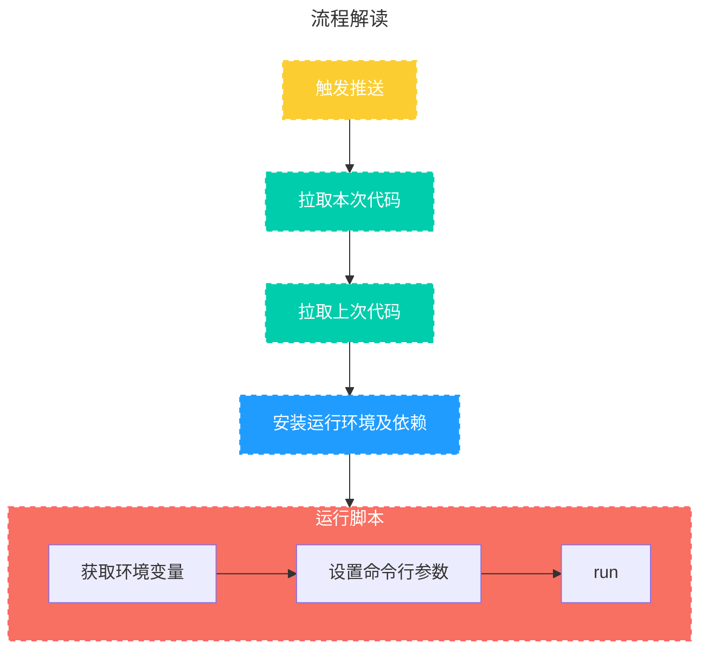

:::info
这是一个`GitHub Actions`的配置文件，整体思路是，获取本次更新的url
（通过对比两次提交的sitemap.xml文件），所以触发条件是deploy分支有推送并修改了`sitemap.xml`文件，再利用python脚本进行url推送到百度、Bing、Google

脚本代码请看这里👉[提交URL到搜索引擎（百度、Bing、Google）](/posts/Python/submit-url)
:::
<!-- more -->
前些天不是写了Bing的提交脚本吗，但是每次都要自己手动跑脚本也很麻烦，但我又没有服务器，所以用上了GitHub Actions了嘛
总的来说做了以下事情：
1. 提交代码并修改sitemap.xml 后触发工作流
2. 比对上一次提交和本次提交的新增URL
3. 将URL分别提交给百度站长、Bing、Google 供搜索引擎快速收录
4. 
## 流程解读

## 配置代码

```yaml
name: 推送脚本

on:
  push:
    branches:
      - gh-pages
    paths:
      - 'sitemap.xml'

jobs:
  push_bot:
    runs-on: ubuntu-latest
    steps:
      - name: Checkout gh-pages branch
        uses: actions/checkout@v3
        with:
          fetch-depth: 0
          ref: 'gh-pages'
          path: gh-pages
          
      - name: 获取上一次提交SHA
        id: last-commit
        run: |
          cd gh-pages
          PREV=$(git log --format="%H" -n 2 | tail -n 1)
          echo "SHA_KEY=$PREV" >> $GITHUB_OUTPUT
          echo $PREV
        
      - name: 拉取prev代码
        uses: actions/checkout@v3
        with:
          ref: ${{ steps.last-commit.outputs.SHA_KEY }}
          path: prev

      - name: Checkout main branch
        uses: actions/checkout@v3
        with:
          ref: 'main'
          path: main

      - name: Set up Python
        uses: actions/setup-python@v4
        with:
          python-version: "3.10"
          cache: "pip" # 设置缓存

      - name: 安装依赖
        run: |
          pip install -r main/script/requirements.txt
      - name: 运行脚本
        env:
          #设置secrets的环境变量
          BAIDU_KEY: ${{ secrets.BAIDU_KEY }}
          BING_KEY: ${{ secrets.BING_KEY }}
          GOOGLE_JSON: ${{ secrets.GOOGLE_JSON }}
        run: |
          python main/script/submit.py --sitemap gh-pages/sitemap.xml --prevsitemap prev/sitemap.xml
```

## 配置解读

#### 触发

这个例子的触发机制如下：
1. 当有推送行为发生
2. 推送分支为`gh-pages`
3. `sitemap.xml`文件被修改

#### 配置运行环境

这里指定`ubuntu-latest`

#### 步骤
1. 拉取 gh-pages 分支代码到路径`gh-pages`
2. 获取上一次提交SHA-1值使用如下命令，将获取到的倒数第二次git提交SHA-1值存储到环境变量`GITHUB_OUTPUT`[^out]中，方便后续使用
   ```bash
    cd gh-pages
    PREV=$(git log --format="%H" -n 2 | tail -n 1)
    echo "SHA_KEY=$PREV" >> $GITHUB_OUTPUT
    echo $PREV
   ```
3. 获取上一步存储到到`GITHUB_OUTPUT`的commitid，并拉取代码代码到路径prev，ref可以是分支，tag，commitid
   ```yaml
    name: 拉取prev代码
    uses: actions/checkout@v3
    with:
        ref: ${{ steps.last-commit.outputs.SHA_KEY }}
        path: prev
   ```
4. 拉取main分支代码到路径main
5. 安装python环境并设置缓存
6. 安装python依赖库
7. 运行脚本读取配置在仓库-->Settings-->Secrets and variables-->Actions-->Repository secrets中的环境变量，并把上次提交的sitemap.xml和本次提交的sitemap.xml作为命令行参数提交给python脚本
   
   

[^out]:[设置步骤的输出参数](https://docs.github.com/zh/actions/using-workflows/workflow-commands-for-github-actions#setting-an-environment-variable)
