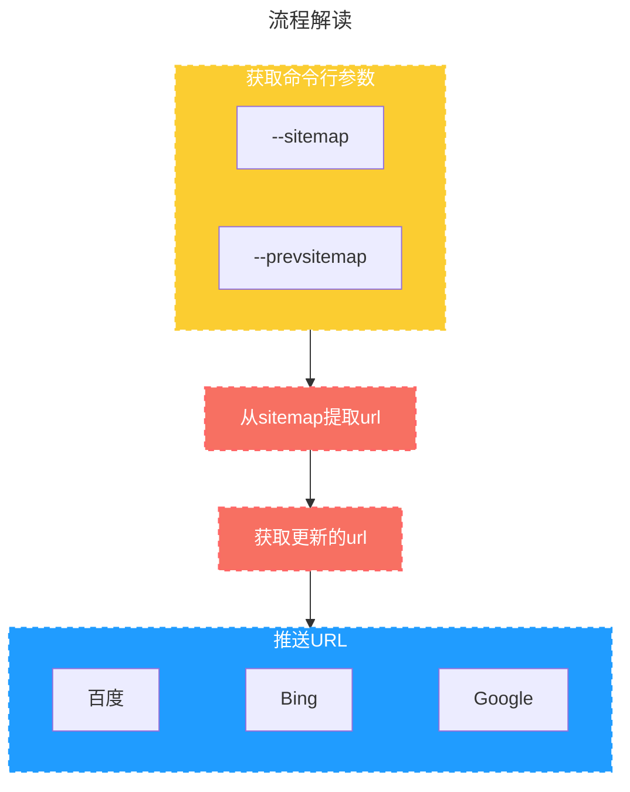

:::info
这是一个利用`GitHub Actions`自动触发的工作流进行解析更新的url并推送到搜索引擎的python脚本,除了之前介绍过的bing api之外，还增加了百度和Google的相关内容

关于`GitHub Actions`的介绍可以看这里👉[GitHub Actions](/tutorial/github/github-action)

关于`GitHub Actions`的配置可以看这里👉[如何利用GitHub Actions推送URL到搜索引擎](/blog/auto-push)
:::
<!-- more -->


## 流程图


## 代码
::: details 代码
```python
#!/usr/bin/python3
# -*- coding: UTF-8 -*-

import json
import os
import requests
import argparse
import xml.etree.ElementTree as ET
from oauth2client.service_account import ServiceAccountCredentials
from googleapiclient.discovery import build

# 从命令行参数提取sitemap


def get_sitemap_path():
    parser = argparse.ArgumentParser()
    parser.add_argument(
        '--sitemap', help='Path to current file', required=True)
    parser.add_argument(
        '--prevsitemap', help='Path to prev file', required=True)
    args = parser.parse_args()
    global sitemap_path
    global prev_sitemap_path
    sitemap_path = getattr(args, 'sitemap')
    prev_sitemap_path = getattr(args, 'prevsitemap')
    print(f"当前：{sitemap_path} \n上次: {prev_sitemap_path}")

# 从sitemap提取url


def extract_urls_from_sitemap(sitemap_path):
    urls = []
    with open(sitemap_path, 'r') as f:
        tree = ET.parse(f)
        root = tree.getroot()
        for url in root.findall('{http://www.sitemaps.org/schemas/sitemap/0.9}url'):
            # 获取 loc 元素的文本内容
            loc = url.find(
                '{http://www.sitemaps.org/schemas/sitemap/0.9}loc').text
            urls.append(loc)
    return urls

# 获取更新的url


def diff_urls(urls, prev_urls):
    final_urls = list(set(urls) - set(prev_urls))
    return final_urls

# 推送URL列表到百度站长


def push_urls_to_baidu(urls, site_url):
    token = os.environ["BAIDU_KEY"]  # 因为$前面是大写所以也是大写
    url = 'http://data.zz.baidu.com/urls?site={}&token={}'.format(
        site_url, token)
    headers = {
        'Content-Type': 'text/plain',
        'User-Agent': 'curl/7.12.1',
        'Host': 'data.zz.baidu.com'
    }
    data = '\n'.join(urls)
    response = requests.post(url, headers=headers, data=data)
    if response.status_code == 200:
        print(f"🎉百度推送成功!:\n{response.content}")
    else:
        print(f"🛎百度Error:\n{response.content} ")

# 调用Bing API提交URL


def push_urls_to_bing(urls, site_url):
    bing_api_key = os.environ["BING_KEY"]
    bing_api_url = "https://ssl.bing.com/webmaster/api.svc/json/SubmitUrlBatch?apikey=" + bing_api_key

    headers = {"Content-Type": "application/json"}

    data = {
        "siteUrl": site_url,
        "urlList": urls
    }

    response = requests.post(bing_api_url, json=data, headers=headers)
    if response.status_code == 200:
        print(f"🎉Bing推送成功!:\n{response.content}")
    else:
        print(f"🛎Bing Error:\n{response.content} ")

# Google index API


def push_urls_to_google(urls):
    SCOPES = ["https://www.googleapis.com/auth/indexing"]

    # service_account_file.json is the private key that you created for your service account.
    JSON_KEY_FILE = json.loads(os.environ["GOOGLE_JSON"])

    credentials = ServiceAccountCredentials.from_json_keyfile_dict(
        JSON_KEY_FILE, scopes=SCOPES)

    # Build service
    service = build('indexing', 'v3', credentials=credentials)
    batch = service.new_batch_http_request(callback=insert_event)

    for url in urls:

        batch.add(service.urlNotifications().publish(
            body={"url": url, "type": 'URL_UPDATED'}))
    batch.execute()

# goole批处理回调


def insert_event(request_id, response, exception):
    if exception is not None:
        print(f"🛎Google Exception:\n{exception} ")
    else:
        print(f"🎉Google推送成功!:\n{response}")


# 主程序
if __name__ == '__main__':
    site_url = 'https://oragekk.me'
    sitemap_path = ''
    prev_sitemap_path = ''
    get_sitemap_path()
    urls = extract_urls_from_sitemap(sitemap_path)
    prev_urls = extract_urls_from_sitemap(prev_sitemap_path)
    final_urls = diff_urls(urls, prev_urls)
    print(f"需要更新的url:{final_urls}")
    if len(final_urls) > 0:
        push_urls_to_bing(urls, site_url)
        push_urls_to_baidu(urls, site_url)
        push_urls_to_google(final_urls)
    else:
        print("✨未发现要更新的url")
```
:::
依赖库
```text
google_api_python_client==2.85.0
oauth2client==4.1.3
requests==2.28.2
```

## 注意点
1. 此脚本不可直接使用，需配合GitHub Action，如果想要直接使用，请替换其中的环境变量为你的内容 
   - `os.environ["BAIDU_KEY"]` 百度推送token
   - `os.environ["BING_KEY"]`  bing_api_key
   - `os.environ["GOOGLE_JSON"]` google indexing api 认证json
   - 取消 `从命令行参数提取sitemap`的步骤，直接赋值

2. google indexing api参考这里👉[Indexing API 快速入门](https://developers.google.com/search/apis/indexing-api/v3/quickstart?hl=zh_CN)