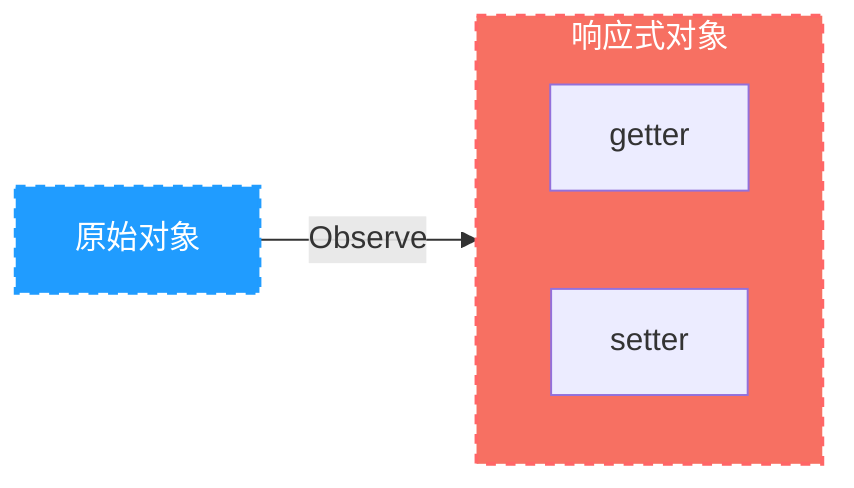

:::info 前言
首先要知道vue2 是2013年 基于 ES5开发出来的，我们常说的重渲染就是重新运行`render`函数

vue2 的响应式原理是利⽤ES5 的⼀个 API ，`Object.defineProperty()`对数据进⾏劫持结合发布订阅模式的⽅式来实现的。
:::

<!-- more -->

[[toc]]


## 1. 思路

带入作者的角度思考一下，想要达成响应式的特点应该是:**属性更新，自动调用依赖[^1]的函数**进行重新渲染

1. 使用属性描述符`Object.defineProperty`监听属性的赋值
2. 赋值完成后调用依赖该属性的函数，那如何获取依赖的函数呢？看第三点
3. 由于依赖会调用属性的get方法，所以可以在get方法中**收集依赖**
4. 然后在set方法中执行这些依赖的函数，称为**派发更新**


基于以上思路的简单实现代码：

```js
// euv.js
/**
 * 观察某个对象的所有属性
 * @param {Object} obj
 */
function observe(obj) {
  for (const key in obj) {
    let internalValue = obj[key];
    let funcs = [];
    Object.defineProperty(obj, key, {
      get: function () {
        //  依赖收集，记录：是哪个函数在用我
        if (window.__func && !funcs.includes(window.__func)) {
          funcs.push(window.__func);
        }
        return internalValue;
      },
      set: function (val) {
        internalValue = val;
        // 派发更新，运行：执行用我的函数
        for (var i = 0; i < funcs.length; i++) {
          funcs[i]();
        }
      },
    });
  }
}

function autorun(fn) {
  window.__func = fn;
  fn();
  window.__func = null;
}

```


```js
// index.js
var user = {
  name: '有骨气',
  birth: '1998-4-7',
};

observe(user); // 观察

// 显示姓氏
function showFirstName() {
  document.querySelector('#firstName').textContent = '姓：' + user.name[0];
}

// 显示名字
function showLastName() {
  document.querySelector('#lastName').textContent = '名：' + user.name.slice(1);
}

// 显示年龄
function showAge() {
  var birthday = new Date(user.birth);
  var today = new Date();
  today.setHours(0), today.setMinutes(0), today.setMilliseconds(0);
  thisYearBirthday = new Date(
    today.getFullYear(),
    birthday.getMonth(),
    birthday.getDate()
  );
  var age = today.getFullYear() - birthday.getFullYear();
  if (today.getTime() < thisYearBirthday.getTime()) {
    age--;
  }
  document.querySelector('#age').textContent = '年龄：' + age;
}
autorun(showFirstName);
autorun(showLastName);
autorun(showAge);
```


## 2. 原理

vue2响应式原理简单来说就是vue官网上的这图片


通过 ``Object.defineProperty`` 遍历对象的每一个属性，把每一个属性变成一个 ``getter`` 和 ``setter`` 函数，读取属性的时候调用 ``getter``，给属性赋值的时候就会调用 ``setter``.



当运行 `render` 函数的时候,发现用到了响应式数据，这时候就会运行 ``getter`` 函数，然后 watcher（发布订阅）就会记录下来。当响应式数据发生变化的时候，就会调用 ``setter`` 函数，watcher 就会再记录下来这次的变化，然后通知 `render` 函数，数据发生了变化，然后就会重新运行 `render` 函数，重新生成虚拟 dom 树。

## 3. 深入了解

我们要明白，响应式的最终目标：**是当对象本身或对象属性发生变化时，会运行一些函数，最常见的就是 render 函数。不是只有 render，只要数据发生了变化后运行了一些函数，就是响应式,比如 watch。**


在具体实现上，vue 采用了几个核心部件:

1. **Observer**

2. **Dep**

3. **Watcher**

4. **Scheduler**

## 4. Observer

observer 要实现的目标非常简单，就是把一个普通的对象转换成响应式的对象

为了实现这一点，observer 把对象的每个属性通过 `object.defineProperty` 转换为带有 `getter` 和 `setter` 的属性，这样一来，当访问或者设置属性时，vue 就会有机会做一些别的事情。

==在组件的生命周期中，这件事发生在 `beforeCreate` 之后，create 之前。==

具体实现上，他会递归遍历对象的所有属性，以完成深度的属性转换。

但是由于遍历只能遍历到对象的当前属性，无法监测到将来动态添加或者删除的属性，因此 vue 提供了`$set`和`$delete` 两个实例方法，但是 vue 并不提倡这样使用，我讲到 dep 的时候我再说为什么。

对于数组的话，vue 会更改它的隐式原型，之所以这样做是因为 vue 需要监听那些可能改变数组内容的方法。

数组 --> vue 自定义的对象 --> Array.prototype

总之，observer 的目标，就是要让一个对象，它属性的读取，赋值，内部数组的变化都要能够被 vue 感知到。

### 4.1. 手动转换响应式对象
Vue提供了静态方法：`Vue.observable()` 手动将普通对象转为响应式对象。

```js
var obj = {
    a: 1,
    b: 2,
    c: {
        d: 3,
        e: 4
    },
    f: [
        {
            a: 1,
            b: 2
        },
        3, 4, 5, 6
    ]
}

// 利用Vue提供的静态方法 .observable, 将一个普通对象转化为响应式对象
var reactiveObj = Vue.observable(obj)
console.log(reactiveObj)
```

### 4.2. data

Vue不允许动态添加根级响应式属性，所以需要在组件实例化之前通过配置中的 `data` 字段，声明所有根级响应式属性，哪怕属性值为 `null`。由此带来的好处有：

1. 更易于维护： data对象就像组件的状态结构（schema）, 提前声明所有响应式属性，后期有助于开发者理解和修改组件逻辑。
2. 消除了在依赖项跟踪系统中的一类边界情况。
3. 使Vue实例能够更好的配合类型检查系统工作。

### 4.3. 「动态添加或删除属性」

由于Vue会在初始化实例时，对所有属性（配置里 `data` 中存在的属性）执行 getter/setter 的转化。

那么对于 **「动态添加或删除」** 的属性，Vue是无法自动检查其变化。

因此，Vue提供了以下方式来手动完成响应式数据。

1. 添加：**「Vue.set(target, key, val)」** 或 **「this.$set(target, key, val)」**
2. 删除：**「Vue.delete(target, key)」** 或 **「this.$delete(target, key)」**
3. 批量操作：`this.reactiveObj = Object.assign({}, this.reactiveObj, obj)`

举个例子：

```vue
<template>
    <div class="demo-wrapper">
        <p>obj.a -> {{ obj.a }}， obj.b -> {{ obj.b }}</p>

        <!-- 非响应式式数据操作 -->
        <!-- 
            <button @click="obj.b = 2">add obj.b</button>
            <button @click="delete obj.a">delete obj.a</button>
        -->
        <!-- 响应式数据操作 -->
        <button @click="$set(obj, 'b', 2)">add obj.b</button>
        &nbsp;
        <button @click="$delete(obj, 'a')">delete obj.a</button>
    </div>
</template>

<script>
export default {
    data() {
        return {
            obj: {
                a: 1,
            },
        };
    },
};
</script>
```

### 4.4. **「关于数组」**

由于js的限制， Vue不能检测到以下数组变动：

1. 当利用索引直接改变数组项时， 例如：`vm.arr[idx] = newValue`
2. 当修改数组长度时 ，例如： `vm.arr.length = newLength`

举个例子：

```vue
<script>
export default {
    data() {
        return {
            arr: [1, 2, 3, 4],
        };
    },
    created() {
        window.lesson4 = this;
    },
    mounted() {
        this.arr[0] = 8; // 不是响应式的
        this.arr.length = 2; //不是响应式的
    }
};
</script>
```

为了让上述数组操作具有响应式，采用以下方法处理：

```vue
<script>
export default {
    data() {
        return {
            arr: [1, 2, 3, 4],
        };
    },
    created() {
        window.lesson4 = this;
    },
    mounted() {
				// 操作一：通过索引修改数组项
        this.$set(arr, 0, 8); // 响应式的
        // 或
        Vue.set(arr, 0, 8);  // 响应式的
        // 或
        this.arr.splice(0, 1, 8) //响应式的
      
        // 操作二：修改数组长度为2
        this.arr.splice(2) // 响应式的
    }
};
</script>
```

除了可以通过静态方法 `Vue.set()` 和 实例方法 `this.$set()` 响应式的修改数组项的值。还可以使用数组方法 - `splice()` 。

因为，Vue对一些可以改变数组自身内容的操作API，如：splice()、sort()、push()、pop()、reverse()、shift()、unshift() 等进行了拦截和重写。从而在开发者使用这些API时，可以触发响应式数据，进而更新视图。

```vue
<script>
  export default{
    data() {
      return {
        arr: [1,2,3,4]
      }
    },
    mounted() {
      console.log(this.arr._proto_ === Array.prototype)  // => false
      console.log(this.arr._proto_._proto_ === Array.prototype)  //=> true
    }
  }
</script>
```

## 5. Dep

这里有两个问题没解决，就是读取属性时要做什么事，属性变化时又要做什么事，这个问题就得需要 dep 来解决

dep 的含义是 dependency 表示依赖的意思。

vue 会为响应式对象中的每一个属性，对象本身，数组本身创建一个 dep 实例，每个 dep 实例都可以做两件事情：

1，记录依赖：是谁在用我  

2，派发更新：我变了，我要通知那些用我的人

当读取响应式对象的某一个属性时，他会进行依赖收集，有人用到了我

当改变某个属性时，他会派发更新，那些用我的人听好了，我变了


为什么尽量不要使用`$set` `$delete` ?  

因为如果模板上没有用到值的话，你凭空加了一个数据,理论上来说应该不会重新运行`render`函数，但是上一级的dep发现自身发生改变了，所以也会导致重新运行render函数。

所以vue不建议使用`$set` 和`$delete`,最好提前先写上数据,哪怕先给数据赋值为 null;

## 6. watcher

这里又出现了一个问题，就是 dep 如何知道是谁在用我呢

watcher 就解决了这个问题

当函数执行的过程中，用到了响应式数据，响应式数据是无法知道是谁在用自己的

所以，我们不要直接执行函数，而是把函数交给一个 watcher 的东西去执行，watch 是一个对象，每个函数执行时都应该创建一个 watcher，通过 wacher 去执行

watcher 会创建一个全局变量，让全局变量记录当前负责执行的 watcher 等于自己，然后再去执行函数，在函数执行的过程中，如果发生了依赖记录，那么 dep 就会把这个全局变量记录下来，表示有一个 wathcer 用到了我这个属性。

当 dep 进行派发更行时，他会通知之前记录的所有 watcher，我变了。

## 7. Scheduler

现在还剩下最后一个问题啊，就是 dep 通知 watcher 之后，如果 wathcer 执行重新运行对应的函数，就有可能导致频繁运行，从而导致效率低下，试想，如果一个交给 watcher 的函数，它里面用到了属性 a,b,c,d,那么 a,b,c,d 都会记录依赖，然后这四个值都以此重新赋值，那么就会触发四次更新，这样显然不行啊，所以当 watcher 收到派发更新的通知后，实际上并不是立即执行，而是通过一个叫做 nextTick 的工具方法，把这些需要执行的 watcher 放到事件循环的微队列，nextTick 是通过 Promise then 来完成的。

也就是说，在响应式数据发生变化时，render 函数执行是异步的，并且在微队列中。

## 8. **异步更新队列**

> Vue侦听到数据变化，就会开启一个队列。但是组件不会立即重新渲染，而是先会缓冲在同一个事件循环中的发生的所有数据变化。此时如果同一个watcher被多次触发，只会被推入到队列中一次，这样可以**「避免不必要的计算和DOM更操作」**。
> 在下一个事件循环”tick“中， Vue刷新队列并执行实际（已去重的）工作（更新渲染）。
> 为此，Vue提供了异步更新的监听接口 —— `Vue.nextTick(callback)` 或 `this.$nextTick(callback)` 。当数据发生改变，异步DOM更新完成后，callback回调将被调用。开发者可以在回调中，操作更新后的DOM。
> 

**「举例1」**

```vue
<script>
export default {
    data() {
        return {
            a: 1,
            b: 2,
            c: 3,
            d: 4,
        };
    },
    methods: {
        changeAllData() {
            this.$nextTick(function () {
                var pre = document.querySelector("pre");
                console.log(pre.textContent);
            });

            this.a = this.b = this.c = this.d = 10;

            this.$nextTick(function () {
                var pre = document.querySelector("pre");
                console.log(pre.textContent);
            });
        },
    },
    render(h) {
        console.log('render function')
        return h('div', [
            h('pre', `${this.a}, ${this.b}, ${this.c}, ${this.d}`),
            h('button', {
                on: {
                    click: () => {
                        this.changeAllData()
                    }
                }
            }, 'change all data')
        ])
    }
};
</script>
```

上例，通过一个NextTick组件的渲染，了解下 的用法。为了方便查看组件渲染时，`render`函数被调用的过程，在组件定义时，直接给出`render`函数。当点击按钮后，会在数据修改前后，使用`nextTick`工具方法。分别写入两个读取界面Dom的函数。结果会发现，第一个 `$nextTick` 回调函数获取的数据为旧数据，第二个 `$nextTick`回调函数获取的数据为新数据。

分析一下：

按钮点击后，异步队列的添加步骤是：

1. 第一个 `$nextTick` ，会将自己的回调函数（fn1）加入到当前的异步队列中。
2. 修改数据后， 经过派发更新，Scheduler会将包含了watcher队列执行逻辑的函数（fn2）加入到当前的异步队列中。
3. 第二个 `$nextTick`， 已将自己的回调函数（fn3）加入到当前的异步队列中。

当异步队列执行时，会依次执行 fn1 ， fn2，fn3。而当fn2执行后，界面才会更新最新数据，所以fn1，fn3获取的界面数据前者为旧数据，后者为新数据。

**「举例2」**

```vue
<template>
  <span>{{a}}</span>
</template>
<script>
	export default {
    data() {
      return {
        a: 'hello'
      }
    },
    mounted() {
      this.a = 'world'
      console.log(this.$el.textContent)  // -> 'hello'
      this.$nextTick(function() {
        console.log(this.$el.textContent) // -> 'world'
      })
    }
  }
</script>
```

上面代码，当设置 `this.a = 'world'` 后，访问DOM元素内容，但完成未更新。此时，立即使用 `this.$nextTick()` 监听DOM更新，并在监听回调调用时，获取更新后的DOM内容。

另外， `this.$nextTick()` 其内部尝试使用原生的 `Promise.then`、`MutationObserve`、`setImmediate`，如果执行环境不支持，则会采用 `setTimeout` 替代。并且最终返回一个`Promise`对象，所以可以使用 `async/await` 语法替代 `callback`的写法。

```vue
<script>
	export default {
    data() {
      return {
        a: 'hello'
      }
    },
    // $nextTick 结合 async/await语法使用
    async mounted() {
      this.a = 'world'
      console.log(this.$el.textContent)  // -> 'hello'
      await this.$nextTick()
      console.log(this.$el.textContent) // -> 'world'
    }
  }
</script>
```

## 9. 总流程图


[^1]:依赖：某个函数在运行期间用到这个属性的get方法
