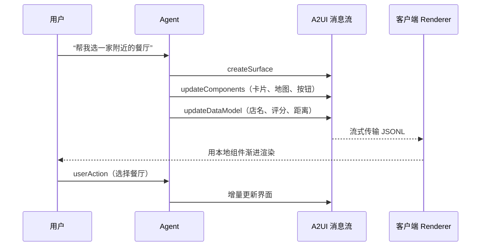
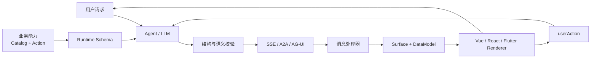
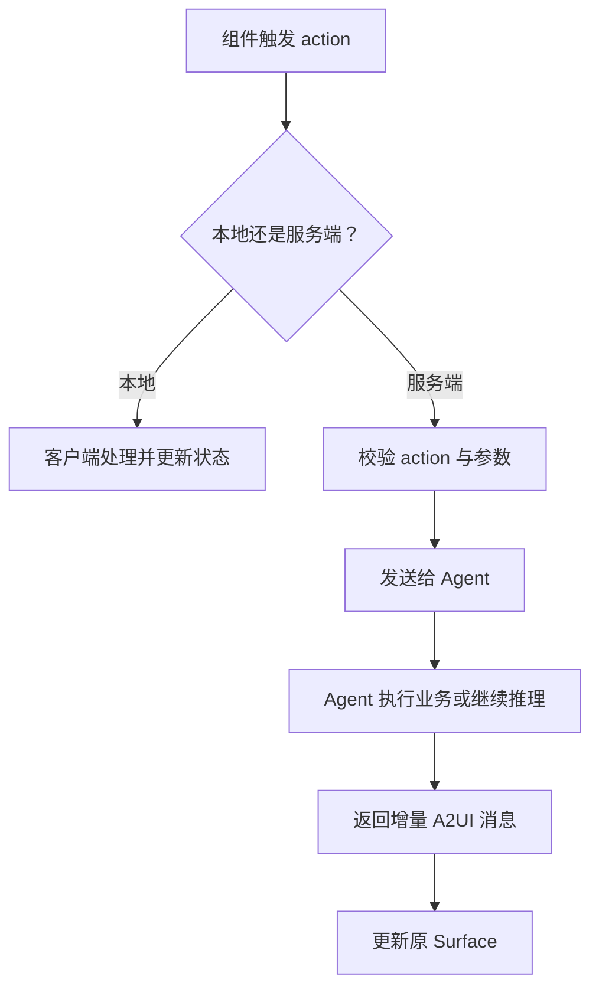

# A2UI：当 AI Agent 开始直接生成界面


过去，Agent 最常见的输出是一段文字。即使它已经查到航班、算好预算，也只能告诉你“有三个选项”，然后让你自己在文本里找重点。

当 Agent 从“陪聊”走向“办事”，纯文本很快会遇到瓶颈：数据对比更适合图表，信息收集更适合表单，地点推荐更适合地图，审批任务也应该直接给出确认按钮。

A2UI（Agent-to-User Interface）想解决的正是这个问题：**让 Agent 不只回答内容，还能声明此刻最合适的交互界面。**

<!-- more -->

## 从 Markdown 组件到生成式 UI

在 A2UI 之前，很多团队已经在聊天消息里嵌入自定义组件。例如让模型输出一段特殊标记：

```text
::: ProductCard {"productId": "123"}
:::
```

前端识别标记后渲染商品卡片。这种方案足够简单，适合组件少、流程固定的业务，但它本质上仍是“模型填模板”：

- Agent 必须记住每个组件的私有语法。
- 前端、后端和 Prompt 共享一套隐式约定，修改一端容易影响另外两端。
- 模型只能选择预设模板，很难动态组合表单、图表和操作按钮。
- 不同客户端需要重复实现同一套解析逻辑。

B 站商业广告团队也经历了类似演进：早期 AI 助手通过 Markdown 和自定义组件输出内容，随着广告诊断、数据分析等场景变复杂，开始基于 A2UI 建设 Agent、后端与 Vue 渲染器工具链。这说明生成式 UI 的价值并不是“界面更炫”，而是让 Agent 的表达能力跟上它的任务能力。详见[哔哩哔哩技术实践](https://juejin.cn/post/7644233699760324662)。

## A2UI 到底是什么？

A2UI 是 Google 发起的开放协议。Agent 发送的不是 HTML、CSS 或 JavaScript，而是一组声明式 JSON 消息：这里需要一张卡片、那里需要一个日期选择器，这个按钮触发哪个 action。客户端再把这些抽象组件映射成已有的 React、Angular、Lit、Flutter 或业务组件。

因此，同一份 UI 意图可以在 Web、Android、iOS 上呈现为各自的原生体验，同时继续遵守宿主应用的品牌、无障碍与安全规则。

截至 2026 年 8 月，官网将 **v0.9.1 标记为 Current，v1.0 仍是 Candidate**。协议已经可用，但仍在快速演进，生产接入应锁定协议与 Catalog 版本。详见 [A2UI 官方规范](https://a2ui.org/specification/v0.9.1-a2ui/)。

### 四个核心设计

**1. 声明式，而不是可执行代码**

Agent 只描述“需要什么组件、组件之间是什么关系”，客户端决定如何渲染。它既比纯文本丰富，又比执行模型生成的 JavaScript 安全。

**2. 扁平组件列表**

组件通过 ID 相互引用，而不是生成一棵很深的 JSON 树。扁平结构更适合模型逐块生成，也方便后续只更新某个组件。

**3. 结构和数据分离**

`updateComponents` 管结构，`updateDataModel` 管状态。价格发生变化时只更新数据，绑定该路径的组件会自动刷新，不必重发整个界面。

**4. Catalog 决定能力边界**

Catalog 是 Agent 与客户端之间的组件合同。客户端可以声明自己支持 `Text`、`Card`、`DatePicker`，也可以注册企业内部的 `CampaignChart`。未注册的组件不应进入渲染链路。

## 一次交互是怎样发生的？



服务端主要发送四类消息：

| v0.9+ 消息 | 作用 |
| --- | --- |
| `createSurface` | 创建一块独立 UI 区域并指定 Catalog |
| `updateComponents` | 新增或更新组件 |
| `updateDataModel` | 更新组件绑定的数据 |
| `deleteSurface` | 删除 Surface 及其状态 |

网上不少早期案例仍使用 v0.8 的 `beginRendering`、`surfaceUpdate`、`dataModelUpdate`。阅读这些实践时要注意版本差异：思想没有变，但 v0.9 对消息命名、组件结构和 JSON Pointer 数据路径做了简化。

一个简化的 v0.9 组件消息如下：

```json
{
  "version": "v0.9",
  "updateComponents": {
    "surfaceId": "result",
    "components": [
      {
        "id": "root",
        "component": "Column",
        "children": ["title", "confirm"]
      },
      {
        "id": "title",
        "component": "Text",
        "text": {"path": "/summary"}
      },
      {
        "id": "confirm",
        "component": "Button",
        "label": "确认选择",
        "action": {"name": "confirm_restaurant"}
      }
    ]
  }
}
```

数据通过另一条消息进入同一个 Surface：

```json
{
  "version": "v0.9",
  "updateDataModel": {
    "surfaceId": "result",
    "path": "/",
    "value": {
      "summary": "找到 3 家符合条件的餐厅"
    }
  }
}
```

真正决定界面能力的是客户端 Catalog。Agent 可以请求渲染 `Button`，却不能偷偷执行任意脚本。这也是 A2UI 相比“让模型直接吐前端代码”更适合跨信任边界的原因。

## 一套可落地的工程架构

协议只解决数据格式，生产系统还需要把模型的不确定性关进工程边界。结合官方规范与 B 站实践，可以把完整链路拆成五层：



### 1. 客户端先声明能力

请求不应只有用户 Prompt，还应携带当前业务和客户端的能力信息，例如：

- 协议版本：`v0.9.1`。
- 支持的 Catalog ID。
- 允许的组件与属性。
- 允许触发的 action。
- 设备或渲染器能力。

同一个 Agent 面向 Web 管理后台时可以使用宽表格，面向手机时则只声明卡片和列表。能力协商能防止模型生成“协议合法、客户端却不会渲染”的消息。

### 2. 运行时装配 Catalog 与 Schema

不要把所有业务组件一次性塞进 Prompt。后端可以根据业务标识和白名单，动态组装本次请求真正可用的 Catalog：

```text
广告诊断 → Text + MetricCard + LineChart + OptimizeButton
活动报名 → Text + TextField + DatePicker + SubmitButton
地点推荐 → PlaceCard + Map + RoutePreview
```

这样做有三个好处：

- **能力隔离**：不同业务不能误用彼此的高权限 action。
- **降低模型负担**：Schema 越小，选错组件和属性的概率越低。
- **独立演进**：新增业务组件时不必修改核心协议处理器。

### 3. 模型输出必须经过双重校验

“模型通常能输出正确 JSON”不能成为上线依据。至少需要两层校验：

**结构校验**负责确认：

- 消息类型和版本是否合法。
- 必填字段是否存在。
- 组件是否属于当前 Catalog。
- 属性类型、数据路径和子组件引用是否有效。

**语义校验**负责确认：

- action 是否在当前业务白名单内。
- 跳转地址、资源 URL 是否满足安全策略。
- 是否出现循环引用或不存在的组件 ID。
- 高风险操作是否要求用户再次确认。

校验失败时优先降级成普通文本，不要为了“尽量渲染”而放宽客户端边界。

### 4. 文本流和 UI 流分开传输

最脆弱的方案，是让前端从 Markdown 文本流里用正则抠 JSON。一旦模型多输出一个代码围栏或半个括号，整段 UI 都可能失败。

更稳妥的做法是使用独立事件通道：

```text
event: message_stream
data: {"text":"正在分析最近 30 天数据…"}

event: a2ui_message
data: {"version":"v0.9","updateComponents":{...}}

event: finish
data: {"text":"分析完成","a2uiMessages":[...]}
```

文本可以立即展示，A2UI 消息交给专门处理器；如果流式 UI 丢包，还可以从 `finish` 的完整消息恢复。A2UI 不强制使用 SSE，同样可以运行在 WebSocket、A2A、AG-UI 或 MCP 之上。

### 5. 前端渲染器负责确定性

模型可以不稳定，渲染器必须稳定。一个 Vue 渲染器至少需要处理：

- 按 `surfaceId` 隔离组件树与 DataModel。
- 根据 Catalog 把抽象组件映射成 Vue 组件。
- 对消息生成唯一签名，避免重连或历史回放造成重复执行。
- 处理增量、乱序与重复消息。
- 在单个组件失败时显示 fallback，而不是让整条消息崩溃。
- 把组件 action 转换为统一事件，再交给前端或 Agent。

核心渲染逻辑不需要复杂：

```vue
<component
  :is="catalog[node.component]"
  v-bind="resolveProps(node, dataModel)"
  @action="dispatchAction"
/>
```

业务组件也不应依赖消息协议内部实现。可以在外面包一层 Wrapper，统一处理数据绑定、loading、错误边界、埋点和 action 转发；业务方只写普通 Vue 组件。

## Action 如何形成闭环？

A2UI 不是一张静态卡片。用户点击按钮或提交表单后，客户端需要判断 action 在哪里处理：

- **本地 action**：展开面板、复制内容、切换 Tab，可直接由前端完成。
- **Agent action**：继续追问、重新计算、提交业务参数，需要携带 `surfaceId`、组件 ID 和上下文回到 Agent。
- **高风险 action**：支付、删除、授权、提交审批，必须经过客户端权限校验和明确确认，不能因为模型生成了按钮就自动执行。



这条闭环让对话从“一问一答”变成“看结果—操作—继续推理”。但业务系统仍然是最终权限裁判，Agent 只提出意图。

## 它与 MCP、A2A、AG-UI 有什么区别？

可以把几种协议放在同一条链路上理解：

| 协议 | 主要解决的问题 |
| --- | --- |
| MCP | Agent 如何访问工具、资源和上下文 |
| A2A | Agent 与 Agent 如何发现、通信和协作 |
| AG-UI | Agent 与前端之间的事件流和运行时交互 |
| A2UI | Agent 如何声明可移植、可交互的 UI |

A2UI 不绑定传输层，也不是新的前端框架。它更像 Agent 与现有组件库之间的一份 UI 合同：可以经由 A2A 或 AG-UI 传输，也能与 MCP Apps 互补。

## 大厂已经怎么用了？

### Google：从内部统一协议走向产品接入

Google 表示内部团队正在用 A2UI 统一 Agent 的界面输出，Opal 团队也是核心贡献者；Flutter GenUI SDK 使用 A2UI 作为远程 Agent 与应用之间的 UI 声明格式。[Google Workspace](https://developers.google.com/workspace/add-ons/chat/quickstart-a2ui-agent) 已提供 Google Chat + ADK + Vertex AI Agent Engine 的 Early Stage Public Preview 快速入门。

### Google Maps：把“回答地点”变成“可操作地图”

2026 年推出的实验性 [Maps Agentic UI Toolkit](https://developers.google.com/maps/ai/agentic-ui-toolkit?hl=zh-CN) 可按用户意图生成地点卡片、内嵌地图和路线预览，并覆盖 Web、Android、iOS。这类强结构、强交互场景，正是 A2UI 最有价值的方向。

### 哔哩哔哩：在广告业务建设 Vue 工具链

B 站商业广告团队没有停留在协议 Demo，而是围绕真实业务实现了 Runtime Schema、白名单、双重校验、SSE 双通道、Vue 渲染 SDK、DataModel 与 Wrapper 组件体系。

更值得借鉴的是它的渐进式路线：没有推翻已有 AI 助手，而是把 A2UI 作为一种新消息类型接入；通用交互走 A2UI，复杂业务组件继续由业务方开发。这比追求“一切界面都让模型生成”更适合当前阶段。

### 高德生态：补齐国产多端原生渲染

[AGenUI](https://genui.amap.com/) 基于 A2UI v0.9，覆盖 iOS、Android、HarmonyOS，并扩展图表、富文本、Lottie 等组件。它说明国内实践更关注移动端性能、复杂组件和现有设计体系的结合。

### Salesforce：企业 UI 平台开始预留入口

Salesforce 的 Multi-framework 页面已把 A2UI 列入 “coming soon”。这还不等于正式落地，但反映出 CRM、审批、数据录入等企业工作流正在成为协议争夺的重点。[官方说明](https://www.salesforce.com/platform/multi-framework/)

## 现在适合上生产吗？

适合从边界清楚的场景开始：

- 搜索结果与推荐卡片。
- 数据诊断与轻量图表。
- 预约、报名和信息收集表单。
- 审批面板与操作引导。
- 多 Agent 返回的统一结果视图。

暂时不适合把整套应用导航、长链路编辑器或任意前端代码生成都交给 Agent。复杂组件仍然应该由开发者实现，再作为受控能力注册到 Catalog。

落地时守住几条线：

1. 组件、属性和 action 必须白名单化。
2. 模型输出必须经过结构与语义校验。
3. 协议、Catalog 和客户端能力必须版本化。
4. 流式链路要支持重复、乱序、丢包和降级。
5. 支付、删除、授权等高风险操作必须由业务系统再次确认。
6. 可访问性、埋点、错误边界仍由客户端负责。

A2UI 真正有意思的地方，不是让 AI “会画页面”，而是让界面从固定页面变成一次对话中的动态答案——Agent 决定表达什么，客户端仍然决定什么可以被安全地表达。

## 参考资料

- [A2UI v0.9.1 协议规范](https://a2ui.org/specification/v0.9.1-a2ui/)
- [A2UI 消息类型参考](https://a2ui.org/reference/messages/)
- [Google：A2UI v0.9 更新说明](https://developers.googleblog.com/en/a2ui-v0-9-generative-ui/)
- [Google：Introducing A2UI](https://developers.googleblog.com/en/introducing-a2ui-an-open-project-for-agent-driven-interfaces/)
- [哔哩哔哩：我们如何用 A2UI + Vue，让大模型长出“可交互界面”](https://juejin.cn/post/7644233699760324662)
