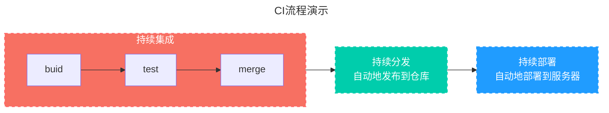

<!-- more -->
[[toc]]

## GitHub Actions 是什么？
Github Actions 是 Github 官方出的持续集成服务, 挺早之前就推出了。类似的还有如微软的DevOps、GitLab CI、Circle CI、Travis CI等等。大家知道，持续集成由很多操作组成，比如抓取代码、运行测试、登录远程服务器，发布到第三方服务等等。GitHub 把这些操作就称为 actions。

很多操作在不同项目里面是类似的，完全可以共享。GitHub 注意到了这一点，想出了一个很妙的点子，允许开发者把每个操作写成独立的脚本文件，存放到代码仓库，使得其他开发者可以引用。

如果你需要某个 action，不必自己写复杂的脚本，直接引用他人写好的 action 即可，整个持续集成过程，就变成了一个 actions 的组合。这就是 GitHub Actions 最特别的地方。

## 什么是CI/CD？

[What is CI/CD? (redhat.com)](https://link.zhihu.com/?target=https%3A//www.redhat.com/en/topics/devops/what-is-ci-cd)

字面意思就是持续集成Continuous Intergation/持续分发Continuous Delivery持续部署Continuous Deployment，网上有太多同质的解释都太过于晦涩，


提到CI/CD就离不开一个词叫流水线。流水线上每个人的工作是分工明确的，而且工程是有先后顺序，就像造一台车，先造零件，然后组装、喷涂、内饰最后还要测试。软件开发同样如此，有前期的产品设计，UI设计、单元的开发，产品的测试，优化迭代等都由不同的人负责。




CI/CD另一个作用就是解决团队代码中的冲突或错误。你提交的代码是否会和其他人的有冲突，如果有就不准你提交，回去再和其他哥们儿商量下。同样这一点也能解决你上传BUG代码的问题，同样禁止你。

如果要做的这几点那就一定需要一个中心化的工厂而且有另一个高效的团队来管理这个工厂的正常运行。CI/CD背后的提供商就是这样的工厂，而为了保证“持续”这个词，任何人都不可能24小时不睡觉帮你在工厂审核你的代码，所以自动化也是CI/CD的一个关键，自动触发机制使得以上所有的操作都是自动化完成的。所以这个工厂其实是无人化的工厂。

说到底CI/CD并不是一项新的技术，而是一种行业的标准，任何人在其上工作都必须遵守的标准，正因有这样的标准化流程，才能让团队的每一个人都能在自己的岗位上有效输出。说白了也就是领导团队想方设法提高员工效率榨干每一分钟的防摸鱼工具。（笑）

确实是这样，CI/CD的标准化工具的出现使得从开发到部署的周期大幅度缩短，再配上云开发的代码仓，那简直就是：云仓CI，法力无边。Github Action出现了。

##  基本概念

GitHub Actions 有一些自己的术语。

（1）**workflow** （工作流程）：持续集成一次运行的过程，就是一个 workflow。

（2）**job** （任务）：一个 workflow 由一个或多个 jobs 构成，含义是一次持续集成的运行，可以完成多个任务。

（3）**step**（步骤）：每个 job 由多个 step 构成，一步步完成。

（4）**action** （动作）：每个 step 可以依次执行一个或多个命令（action）。


## 关于工作流程

工作流是一个可配置的自动化过程，将运行一个或多个作业。工作流由签入到存储库的YAML文件定义，并将在存储库中的事件触发时运行，或者可以手动触发，或者按照定义的计划。

工作流定义在存储库的 `.github/workflows` 目录中，一个存储库可以有多个工作流，每个工作流可以执行一组不同的任务。例如，您可以有一个工作流来构建和测试拉取请求，另一个工作流在每次创建发布时部署您的应用程序，还有一个工作流在每次有人打开新问题时添加标签。

workflow 文件的配置字段非常多，详见[官方文档](https://help.github.com/en/articles/workflow-syntax-for-github-actions)。下面是一些基本字段。

**（1）`name`**

`name`字段是 workflow 的名称。如果省略该字段，默认为当前 workflow 的文件名。

 ```yaml
 name: GitHub Actions Demo
 ```

**（2）`on`**

`on`字段指定触发 workflow 的条件，通常是某些事件。

 ```yaml
 on: push
 ```

上面代码指定，`push`事件触发 workflow。

`on`字段也可以是事件的数组。

 ```yaml
 on: [push, pull_request]
 ```

上面代码指定，`push`事件或`pull_request`事件都可以触发 workflow。

完整的事件列表，请查看[官方文档](https://help.github.com/en/articles/events-that-trigger-workflows)。除了代码库事件，GitHub Actions 也支持外部事件触发，或者定时运行。

**（3）`on.<push|pull_request.<tags|branches`**

指定触发事件时，可以限定分支或标签。

 ```yaml
 on:
   push:
     branches:    
       - master
 ```

上面代码指定，只有`master`分支发生`push`事件时，才会触发 workflow。

**（4）`jobs.<job_id.name`**

workflow 文件的主体是`jobs`字段，表示要执行的一项或多项任务。

`jobs`字段里面，需要写出每一项任务的`job_id`，具体名称自定义。`job_id`里面的`name`字段是任务的说明。

 ```yaml
 jobs:
   my_first_job:
     name: My first job
   my_second_job:
     name: My second job
 ```

上面代码的`jobs`字段包含两项任务，`job_id`分别是`my_first_job`和`my_second_job`。

**（5）`jobs.<job_id.needs`**

`needs`字段指定当前任务的依赖关系，即运行顺序。

 ```yaml
 jobs:
   job1:
   job2:
     needs: job1
   job3:
     needs: [job1, job2]
 ```

上面代码中，`job1`必须先于`job2`完成，而`job3`等待`job1`和`job2`的完成才能运行。因此，这个 workflow 的运行顺序依次为：`job1`、`job2`、`job3`。

**（6）`jobs.<job_id.runs-on`**

`runs-on`字段指定运行所需要的虚拟机环境。它是必填字段。目前可用的虚拟机如下。

 - `ubuntu-latest`，`ubuntu-18.04`或`ubuntu-16.04`
 - `windows-latest`，`windows-2019`或`windows-2016`
 - `macOS-latest`或`macOS-10.14`

下面代码指定虚拟机环境为`ubuntu-18.04`。

 ```yaml
 runs-on: ubuntu-18.04
 ```

**（7）`jobs.<job_id.steps`**

`steps`字段指定每个 Job 的运行步骤，可以包含一个或多个步骤。每个步骤都可以指定以下三个字段。

 - `jobs.<job_id.steps.name`：步骤名称。
 - `jobs.<job_id.steps.run`：该步骤运行的命令或者 action。
 - `jobs.<job_id.steps.env`：该步骤所需的环境变量。

下面是一个完整的 workflow 文件的范例。

 ```yaml
 name: Greeting from Mona
 on: push

 jobs:
   my-job:
     name: My Job
     runs-on: ubuntu-latest
     steps:
      - name: Print a greeting
        env:
         MY_VAR: Hi there! My name is
         FIRST_NAME: Mona
         MIDDLE_NAME: The
         LAST_NAME: Octocat
       run: |
         echo $MY_VAR $FIRST_NAME $MIDDLE_NAME $LAST_NAME.
 ```

上面代码中，`steps`字段只包括一个步骤。该步骤先注入四个环境变量，然后执行一条 Bash 命令。

### 工作流基础

工作流必须包含以下基本组件：

1. 一个或多个将触发工作流的事件。
2. 一个或多个作业，每个作业都将在运行机器上执行并运行一系列一个或多个步骤。
3. 每个步骤都可以运行您定义的脚本或运行操作，这是一个可重用的扩展，可以简化您的工作流程。

### 工作流触发

可以有多种触发方式，具体参见[官方文档](https://docs.github.com/zh/actions/using-workflows/triggering-a-workflow),下面以我的一个工作流举例讲解触发事件
```yaml
on:
  push:
    branches:
      - gh-pages
    paths:
      - 'sitemap.xml'
  schedule:
    - cron: "0 23 * * *"
```

这个例子的触发机制如下：
1. 当有推送行为发生
2. 推送分支为`gh-pages`
3. `sitemap.xml`文件被修改
4. 每天 UTC 23:00触发[^first]
5. push下的分支和文件要同时触发才会使工作流运行

:::danger 注意!!!
虽然官方文档未提及需要把`.github/workflows`目录下的工作流文件存储于指定触发分支下，但我实际操作中发现，如我设置的触发分支为`gh-pages`但假如我的.yaml文件在`main`分支下不在`gh-pages`根目录的`.github/workflows`文件夹下，实际并不会触发。
:::

[^first]: 可以使用 [crontab guru](https://crontab.guru/) 帮助生成 cron 语法并确认其运行时间。 为了帮助入门，还提供了 [crontab guru 示例](https://crontab.guru/examples.html)列表。计划工作流程的通知将发送给最后修改工作流程文件中的 cron 语法的用户。 有关详细信息，请参阅“[工作流程运行通知](https://docs.github.com/zh/actions/monitoring-and-troubleshooting-workflows/notifications-for-workflow-runs)”。

## 实例
<!-- @include: ../../blog/auto-push.md{14-} -->